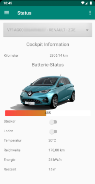
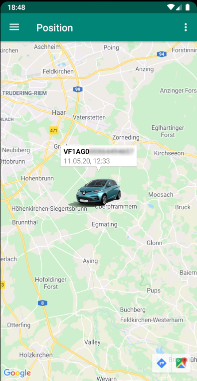
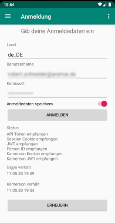

# MyZOE
MyZOE (MeineZOE) is an alternative app to view information about your ZOE.

---
> **NOTE**
I have ceased further development and there will be no distribution of an APK file.
If you want to use this app, please build one yourself.
---

It will display status information about the mileage, the battery, the vehicle's position and maybe more stuff in the future.  
Plans are, to also provide a way to switch on pre-heating and to switch on/off charging.

Here are some example screens:

## Contribute:

 * **Translation**: If you want to help translate MyZOE into your language head over to the [Crowdin project](https://crowdin.com/project/myzoe).
 * **Bug reports and feature requests**: You can report bugs and request features in the [Issue tracker](https://github.com/robertaramar/MyZOE/issues) on GitHub.
 * **Discussion and support**:
   - Telegram group [@MeineZOE](https://t.me/MeineZOE) (if you just want important updates you can mute the group so you only get notified about pinned messages)
